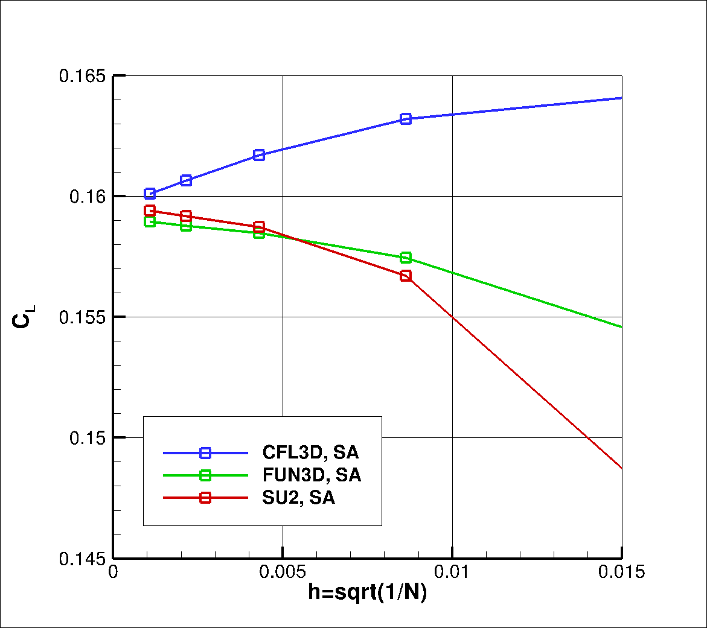
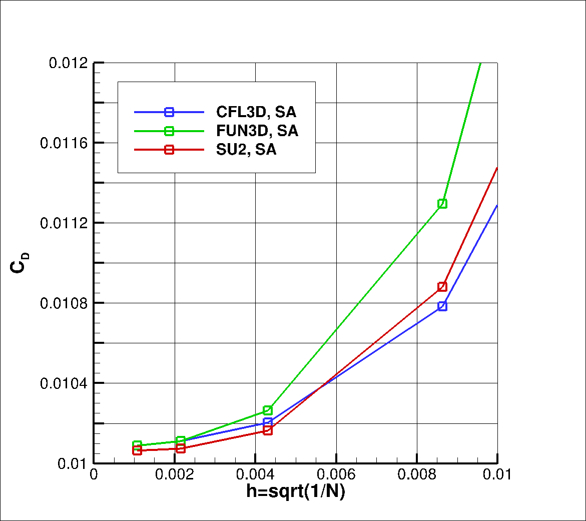
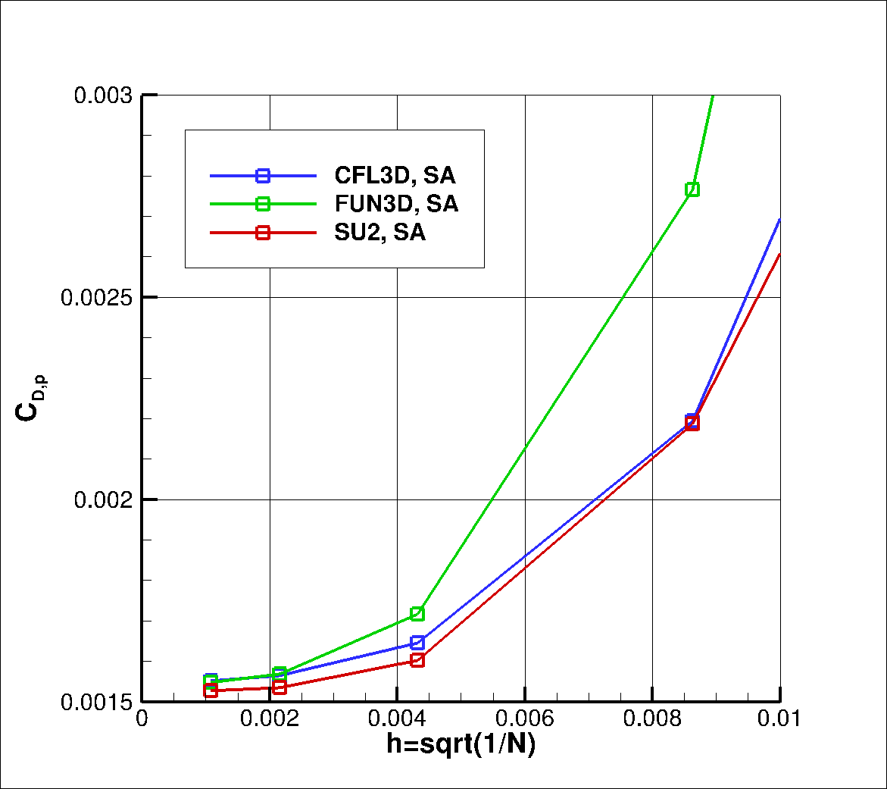
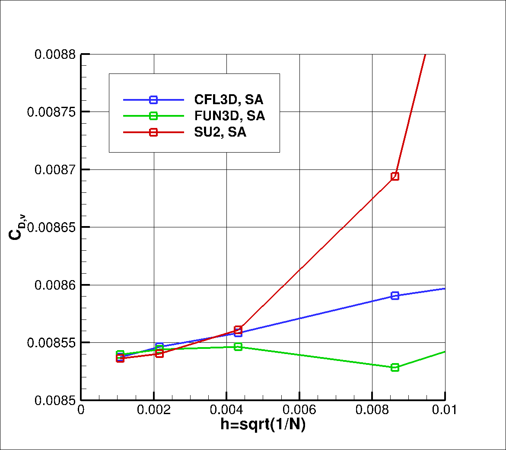
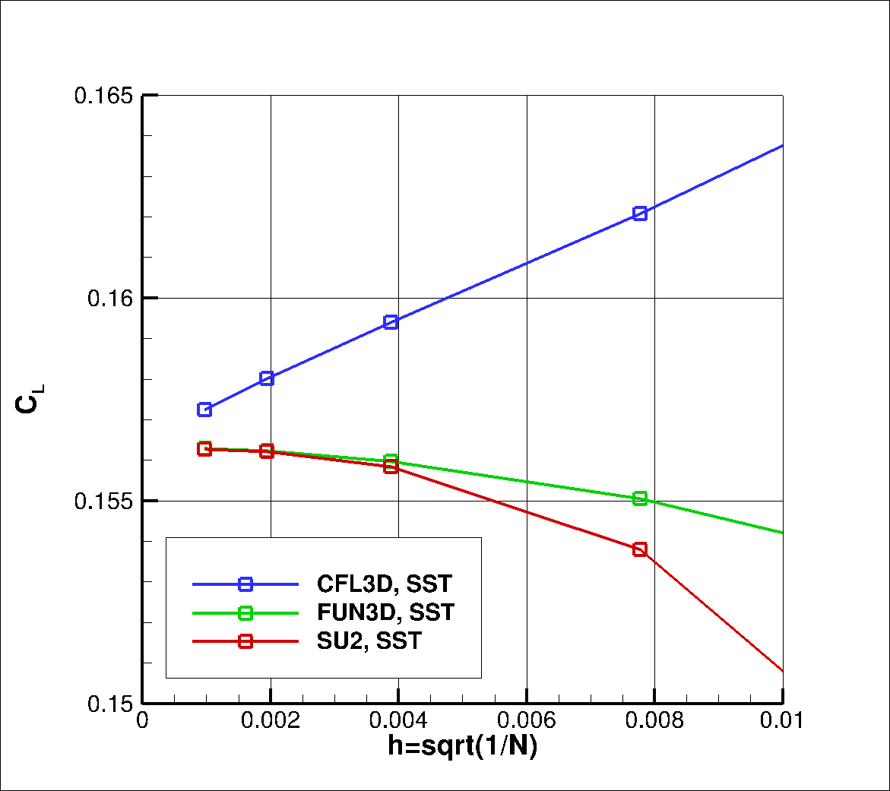
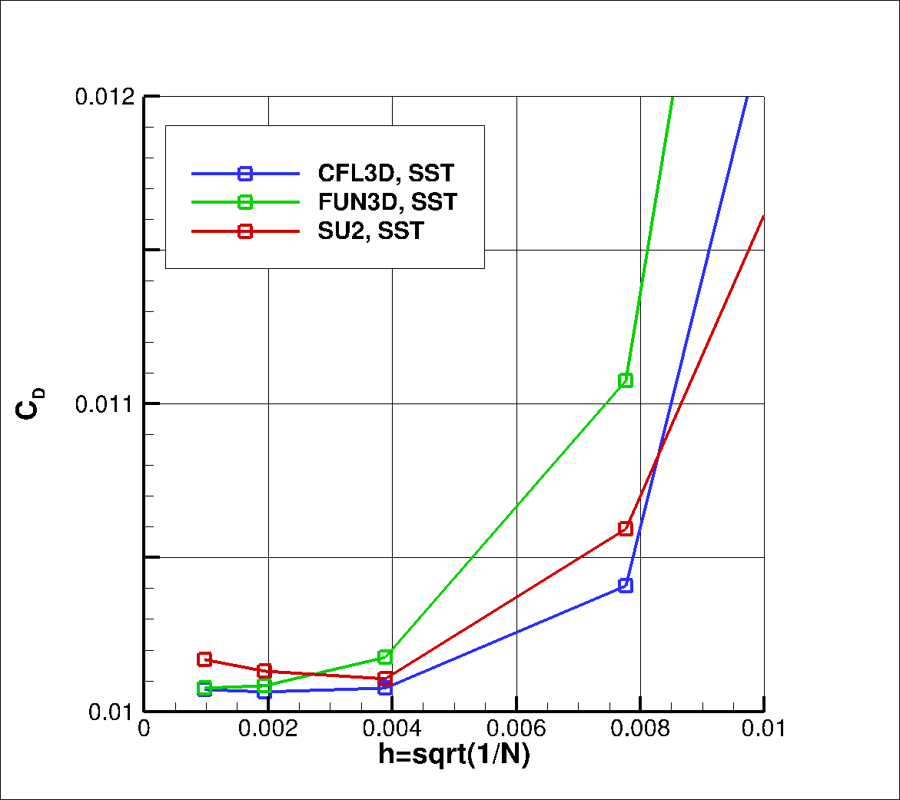

# 2D Airfoil: DSMA661

The details of the the DSMA661 2D Airfoil case are taken from the [NASA TMR website](https://turbmodels.larc.nasa.gov/airfoilwakeverif500c.html). 

## Problem Setup

Turbulent flow over a DSMA661 (Model A) airfoil at a low mach number is a simple test case. There is experimental data available that contains velocity measurements in the near-wake of the airfoil. This data is used to validate the turbulnce models as well. 

This problem will solve the flow past the airfoil with these conditions:
- Freestream Temperature = 300 K
- Freestream Mach number = 0.088
- Reynolds number = 1.2E6
- Reynolds length = 1.0 m

The airfoil has a chord length of 1m and is represented by an adiabatic wall. The outside boundary is 500c away and is defined as a Farfield boundary condition. 

## Mesh Description

Structured meshes of uniformly increasing density are used to perform a grid convergence study. These meshes are present in the subfolders that are named according to the number of vertices on the airfoil surface. The mesh sizes are: 

1. 65    - 4144 quadrilaterals
2. 129   - 16576 quadrilaterals
3. 257   - 66304 quadrilaterals
4. 513   - 265216 quadrilaterals
5. 1025  - 1060864 quadrilaterals

Figure (1): Boundary conditions for the case

Figure (2): Mesh with 257 points on the airfoil

Different formats of this family of meshes can be found at the [NASA Turbulence Modelling Resource page](https://turbmodels.larc.nasa.gov/airfoilwakeverif500c.html). 

## Results
The results for the mesh refinement study are presented and compared to results from FUN3D and CFL3D. Results are presented for the SA and SST turbulence models 

### SA

For the SA turbulence model, we see the following behavior compared to CFL3D and FUN3D. 

The following plots show the mesh convergence for force coefficients: 

Figure (3): Mesh convergence of C_L for different solvers

Figure (4): Mesh convergence of C_D for different solvers

Figure (5): Mesh convergence of pressure component of C_D for different solvers

Figure (6): Mesh convergence of viscous component of C_D for different solvers

### SST

For the SST turbulence model, we see the following behavior compared to CFL3D and FUN3D.

The following plots show the mesh convergence for force coefficients: 

Figure (3): Mesh convergence of C_L for different solvers

Figure (4): Mesh convergence of C_D for different solvers

Figure (5): Mesh convergence of pressure component of C_D for different solvers

Figure (6): Mesh convergence of viscous component of C_D for different solvers

