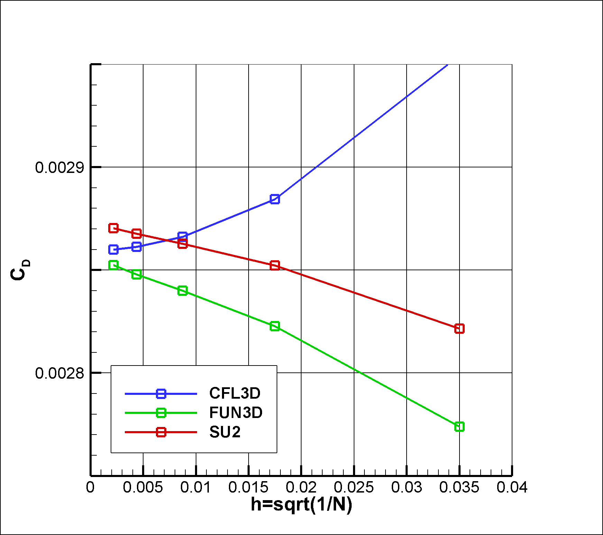
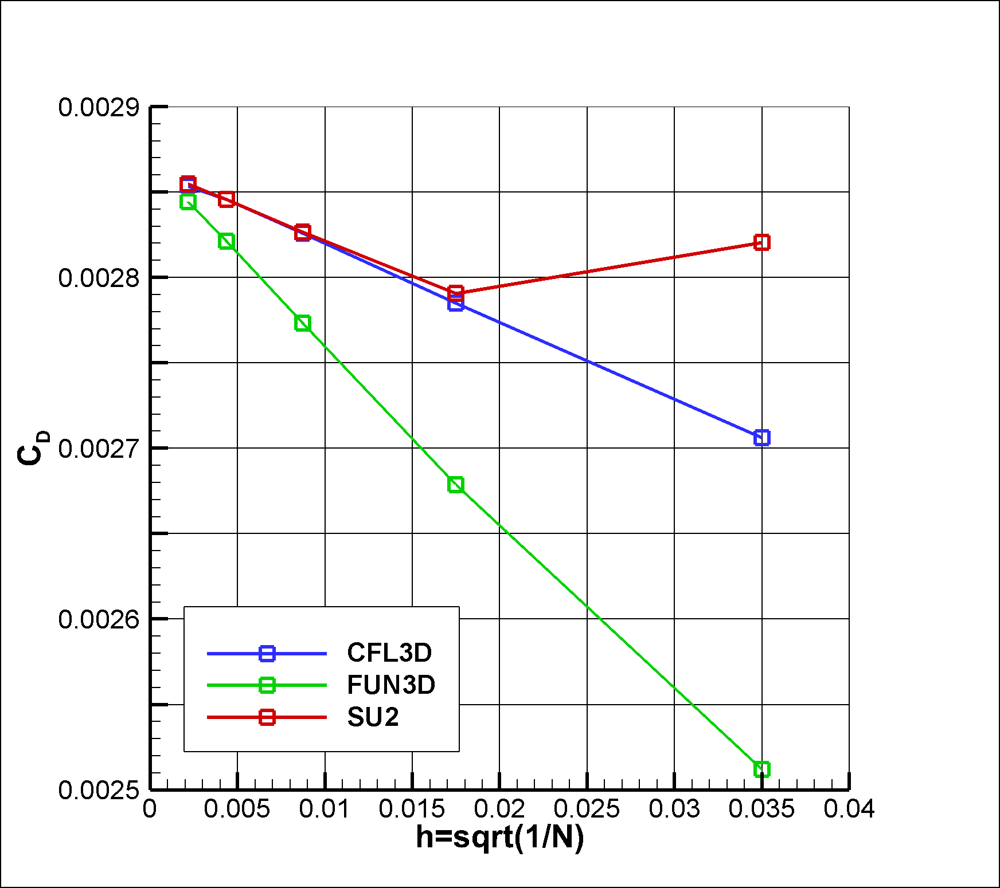

# Zero Pressure Gradient Flat Plate

The Zero Pressure Gradient Flat Plate case is defined [here](https://turbmodels.larc.nasa.gov/flatplate.html). 

The results for the mesh refinement study are presented and compared to results from FUN3D and CFL3D. Results are presented for the SA and SST turbulence models 

## SA

## SST

