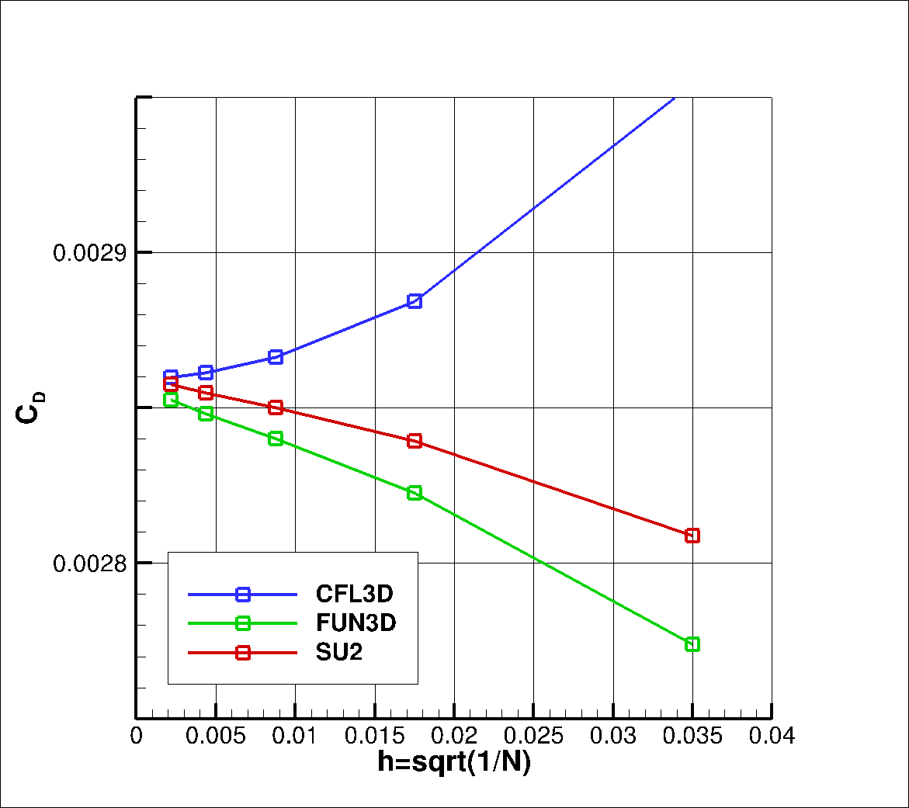
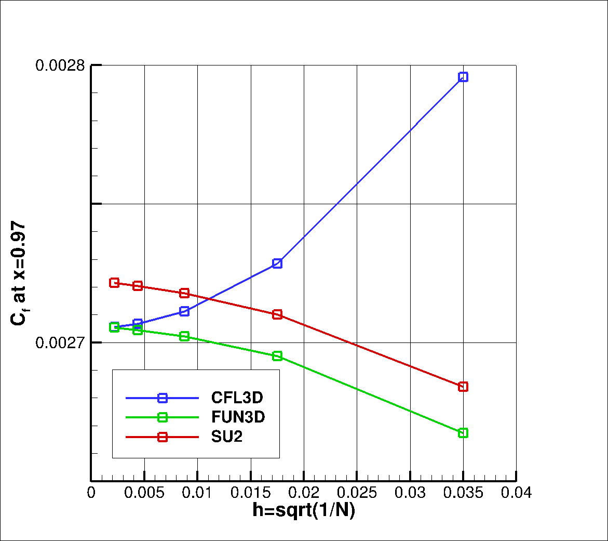
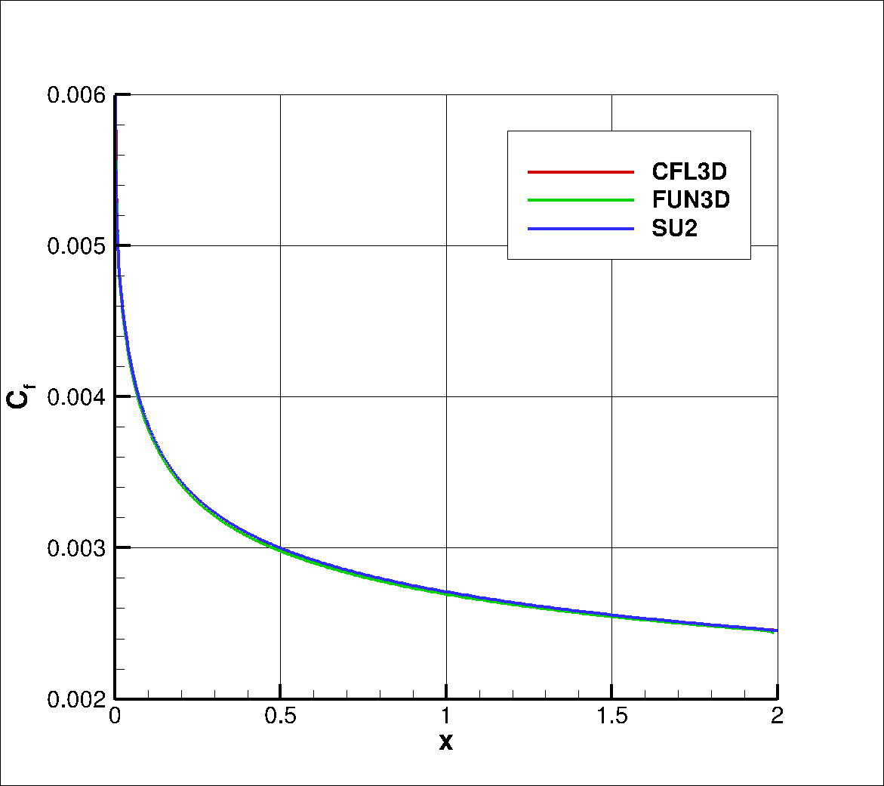
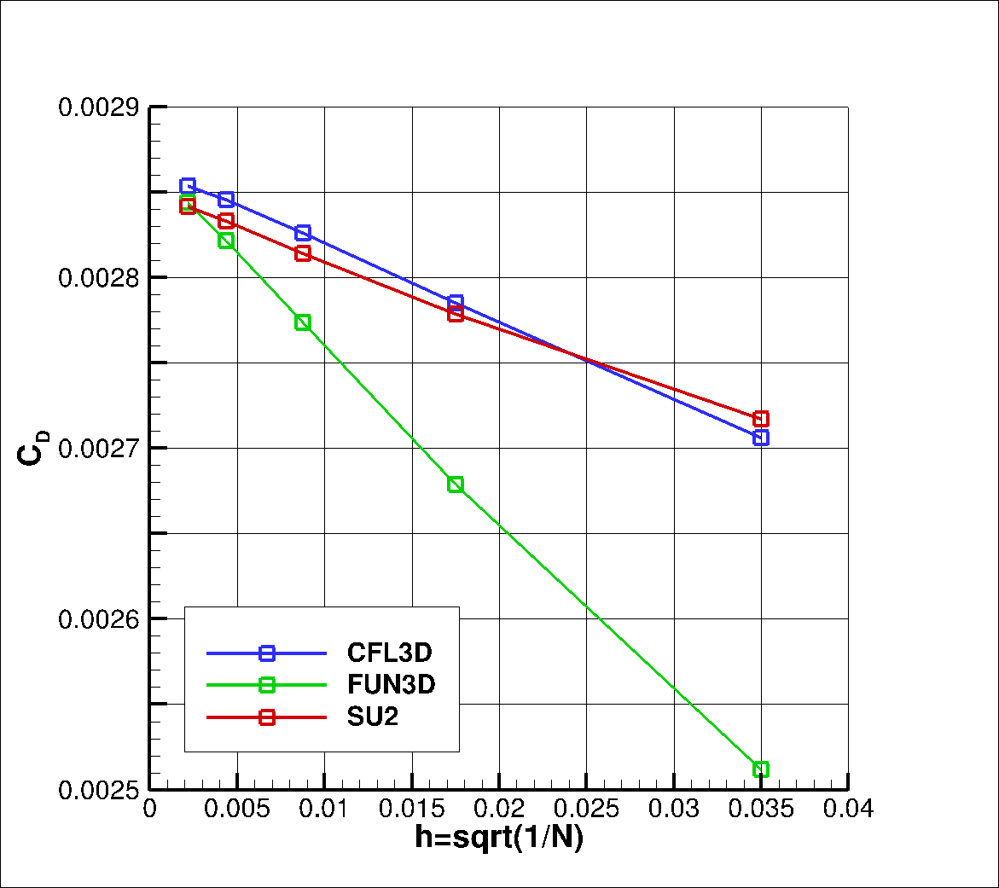
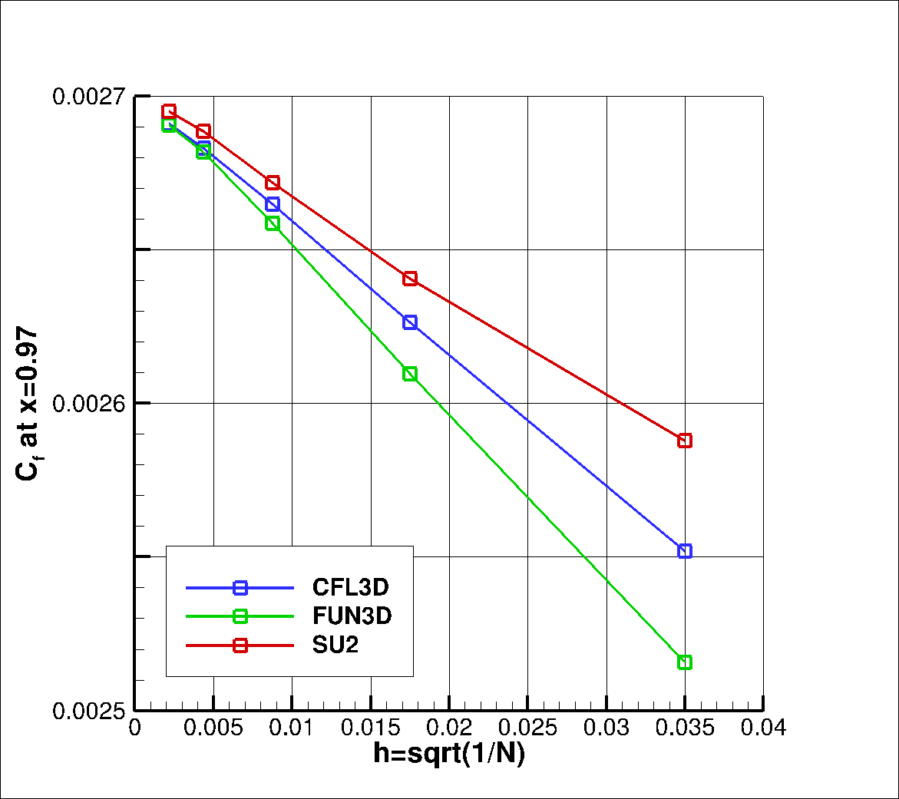
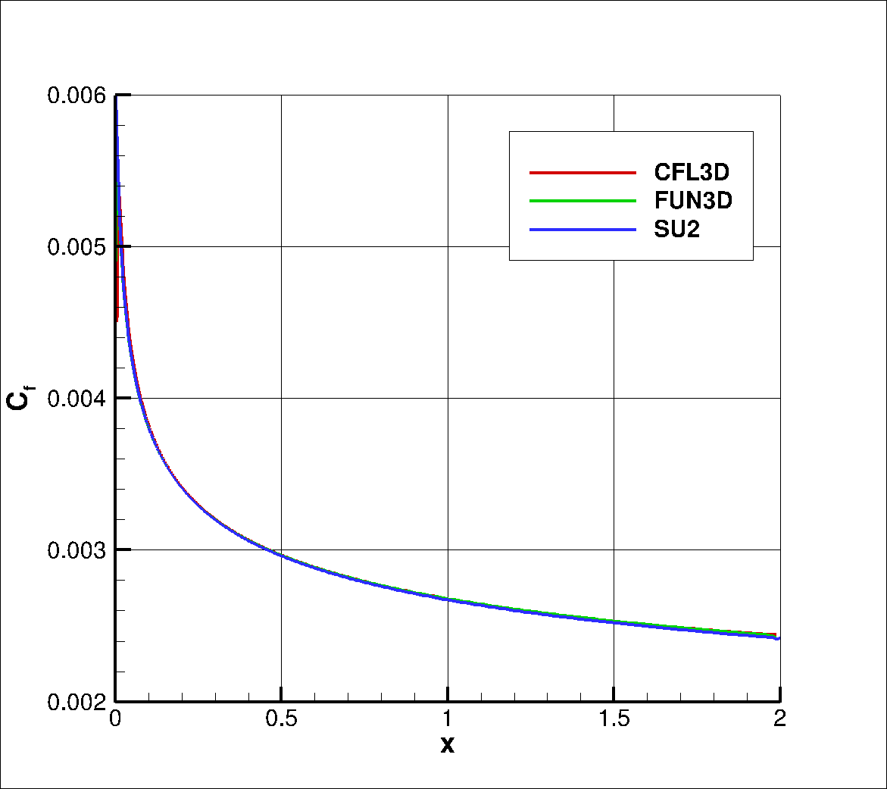

# Zero Pressure Gradient Flat Plate

The details of the Zero Pressure Gradient Flat Plate case are taken from the [NASA TMR website](https://turbmodels.larc.nasa.gov/flatplate.html). 

## Problem Setup

Turbulent flow over a zero pressure gradient flat plate is a common test case for the verification of turbulence models in CFD solvers. The flow is everywhere turbulent and a boundary layer develops over the surface of the flat plate. The lack of separation or other more complex flow phenomena allows turbulence models to predict the flow with a high level of accuracy.

This problem will solve the flow past the flatplate with these conditions:
- Freestream Temperature = 300 K
- Freestream Mach number = 0.2
- Reynolds number = 5.0E6
- Reynolds length = 1.0 m

The length of the flat plate is 2 meters, and it is represented by an adiabatic no-slip wall boundary condition. Also part of the domain is a symmetry plane located before the leading edge of the flat plate. Inlet and outlet boundary conditions are used on the left and right boundaries of the domain, and an outlet boundary condition is used over the top region of the domain, which is located 1 meter away from the flat plate.

## Mesh Description

Structured meshes of increasing density are used to perform a grid convergence study. These meshes are present in the subfolders that are named according to the number of vertices in the x and y directions. The mesh sizes are: 

1. 35x25   - 816 quadrilaterals
2. 69x49   - 3264 quadrilaterals
3. 137x97  - 13056 quadrilaterals
4. 273x193 - 52224 quadrilaterals
5. 545x385 - 208896 quadrilaterals

Figure (1): Mesh with boundary conditions: inlet (red), outlet (blue), symmetry (purple), wall (green).

Different formats of this family of meshes can be found at the [NASA Turbulence Modelling Resource page](https://turbmodels.larc.nasa.gov/flatplate.html). 

## Results
The results for the mesh refinement study are presented and compared to results from FUN3D and CFL3D. Results are presented for the SA and SST turbulence models 

### SA

For the SA turbulence model, we see the following behavior compared to CFL3D and FUN3D.

The following plots show mesh convergence properties of C_D and C_f at x = 0.97.

Figure (2): Mesh convergence of C_D for different solvers

Figure (3): Mesh convergence of C_f at x = 0.97 for different solvers

The following plot shows the coefficient of friction along the flat plate as calculated on the finest mesh. All three solvers predict identical distributions, which is why is looks like one line. 

Figure (4): C_f plot for the finest mesh for different solvers

### SST

For the SST turbulence model, we see the following behavior compared to CFL3D and FUN3D. 

The following plots show mesh convergence properties of C_D and C_f at x = 0.97.

Figure (2): Mesh convergence of C_D for different solvers

Figure (3): Mesh convergence of C_f at x = 0.97 for different solvers

The following plot shows the coefficient of friction along the flat plate as calculated on the finest mesh. All three solvers predict identical distributions, which is why is looks like one line. 

Figure (4): C_f plot for the finest mesh for different solvers
